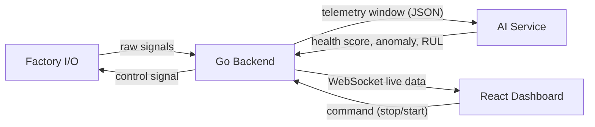

# IIoT Smart Analytics Platform — Project Overview & Team Contracts

This document explains the project in simple words and shows **what each team must
give to the other teams** so everyone can work at the same time without waiting
for each other.

---

## 1. What are we building?

A factory line is watched by sensors (tank level, temperature, motor speed,
vibration, camera). The system:

1. Reads sensor data from the factory.
2. Saves it to a database.
3. Sends a small batch of recent data to an AI service.
4. The AI checks if something looks wrong (anomaly) and predicts how many
   hours the machine can still run (RUL = Remaining Useful Life).
5. Shows everything live on a dashboard (charts + alerts).
6. Lets an operator stop the machine, or lets the AI stop it automatically if
   things get dangerous.

## 2. The three teams

| Team | Builds | Talks to |
|---|---|---|
| **A. Factory IO Engineer** | Simulated factory (Factory I/O) + tags/signals | Backend |
| **B. Backend + Frontend Engineer** | Go (Gin) API, sqlc, PostgreSQL, WebSocket, React dashboard | Factory IO, AI |
| **C. AI Engineer** | Python service for anomaly detection + RUL prediction | Backend |



Each arrow above is a **contract**. If everyone follows the contract, the
three teams can build in parallel and just plug their pieces together at the
end.

---

## 3. Contract A ↔ B: Factory IO ↔ Backend

The Factory IO engineer does not need to know about the database or AI. He
only needs to expose these **signal names** on the chosen protocol (OPC UA or
Modbus — pick one and confirm with Backend team).

| Signal Code | Direction | Type | Range | Meaning |
|---|---|---|---|---|
| `V_IN_1`, `V_IN_2` | Backend → Factory | Digital Out | 0/1 | Open/close raw tank valves |
| `LT_01`, `LT_02` | Factory → Backend | Analog In | 0–10V (0–300 L) | Raw tank levels |
| `LT_03` | Factory → Backend | Analog In | 0–10V | Mixing tank level |
| `TE_01` | Factory → Backend | Analog In | 0–100 °C | Mixing tank temperature |
| `LS_HIGH` | Factory → Backend | Digital In | 0/1 | Overflow safety switch |
| `RPM_01` | Factory → Backend | Analog In | 0–1500 RPM | Conveyor speed |
| `CURR_01` | Factory → Backend | Analog In | 0–25 A | Motor current |
| `VIB_01` | Factory → Backend | Analog In | 0–50 mm/s | Motor vibration |
| `VIS_01` | Factory → Backend | String | OK/DEFECT | Vision inspection result |
| `POS_01` | Factory → Backend | Analog In | 0–5 m | Elevator height |
| `EMERGENCY_STOP` | Backend → Factory | Digital Out | 0/1 | Halt the line |

**Rule:** Factory IO must expose these exact names. Backend will map them to
`sensors.metric_name` in the database. If the Factory IO engineer wants to
add/rename a signal, he must tell the Backend team first.

---

## 4. Contract B ↔ C: Backend ↔ AI Service

This is a plain HTTP contract. Backend is the **client**, AI is the
**server**.

### Request: Backend → AI

`POST /ai/v1/predict`

```json
{
  "machine_id": "MIXING_CONVEYOR_LINE_01",
  "window_size": 30,
  "telemetry_window": [
    {
      "timestamp": "2026-09-07T18:29:30Z",
      "metrics": { "LT_03": 210.0, "TE_01": 64.0, "RPM_01": 1200.0, "CURR_01": 14.2, "VIB_01": 10.1 }
    }
  ]
}
```

### Response: AI → Backend

```json
{
  "machine_id": "MIXING_CONVEYOR_LINE_01",
  "evaluated_at": "2026-09-07T18:30:01Z",
  "health_score": 78.5,
  "is_anomaly": true,
  "anomaly_features": ["VIB_01", "CURR_01"],
  "rul_hours": 142.0,
  "recommended_action": "Inspect conveyor motor bearing for wear within 24 hours."
}
```

**Rules both teams agree on:**
- `health_score` is always `0–100` (100 = perfectly healthy).
- `is_anomaly = true` if `health_score < 60` **or** the AI model itself flags
  an anomaly.
- `rul_hours = -1` means "cannot be estimated yet" (not enough data).
- If AI service is down, Backend must **not crash** — it keeps the last known
  health score and marks it as `stale`.
- Backend decides what to do with `is_anomaly` (e.g. auto emergency stop).
  AI never talks to hardware directly.

---

## 5. Contract B (Backend) ↔ B (Frontend)

Since the same team builds both, this is more of an internal API contract,
but it's written down so both sides (or both developers) can work without
guessing.

### REST endpoints — operator-facing (see file 3 for full details)
- `GET /api/v1/machines/{machine_id}`
- `GET /api/v1/telemetry?sensor_id=&limit=`
- `GET /api/v1/alerts?machine_id=&is_resolved=`
- `POST /api/v1/machines/{machine_id}/command`

### REST endpoints — admin-facing (machine & sensor management)

`machines` and `sensors` are **not** hardcoded in the database. Since the
system may grow to more than one machine/line, the backend must expose
management endpoints for them, separate from the operator endpoints above:

- `POST /api/v1/machines` — register a new machine
- `GET /api/v1/machines` — list all machines
- `PATCH /api/v1/machines/{machine_id}` — update a machine's info/status
- `DELETE /api/v1/machines/{machine_id}` — remove a machine
- `POST /api/v1/sensors` — register a new sensor under a machine
- `GET /api/v1/sensors?machine_id=` — list sensors for a machine
- `DELETE /api/v1/sensors/{sensor_id}` — remove a sensor

**Rule:** These admin endpoints must require a different permission level
than the operator commands above — a regular operator should be able to
press "Emergency Stop" but should **not** be able to add or delete a
machine. See file 3 (Phase 2) for full request/response shapes.

### WebSocket
- `WS /ws/v1/factory-stream` — pushes one JSON frame per second with raw
  telemetry + AI result combined (see file 3 for the payload shape).

**Rule:** Frontend never talks to Factory IO or AI directly. Everything goes
through the Go backend. This keeps the frontend simple and safe.

---

## 6. Shared glossary (all teams should know these words)

| Term | Meaning |
|---|---|
| IIoT | Industrial Internet of Things |
| PLC | Programmable Logic Controller — the "brain" of factory hardware |
| OPC UA | A standard protocol machines use to talk to software |
| Modbus | Another common industrial protocol |
| RUL | Remaining Useful Life — hours before a part likely fails |
| RMS | Root Mean Square — a way to measure vibration strength |
| Sliding window | The last N seconds of data kept in memory for AI |
| Anomaly | Something unusual/abnormal in the sensor data |

---

## 7. Golden rule for all three teams

> Build against the **contract**, not against each other's code.
> As long as the JSON shapes and signal names above don't change without
> agreement, all three teams can work fully in parallel.
